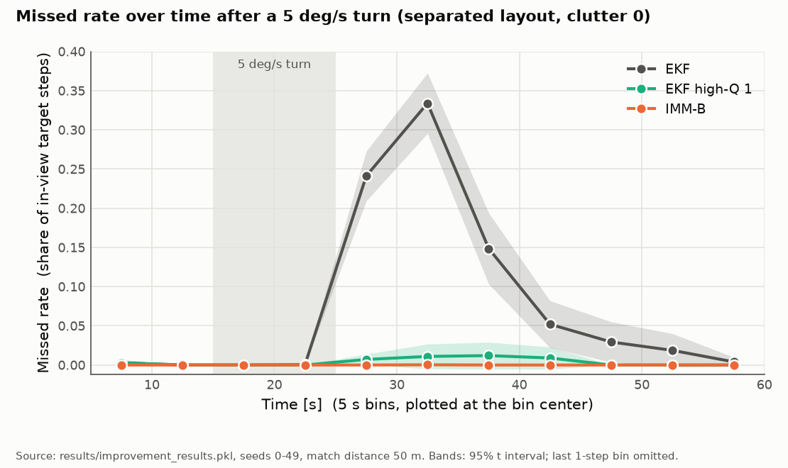

# sensor-fusion-tracking


Simulated radar + camera multi-target tracking with an extended Kalman filter (EKF), gating, track management, sensor outages, an
interacting multiple model (IMM) motion model and a camera-bias estimate; the evaluation uses 50 seeds (0-49) with per-seed paired
comparisons where stated (one diagnostic uses 10), and every result is traced in [docs/RESULTS.md](docs/RESULTS.md).


Up = fewer missed targets during maneuvers, measured as window missed (the share of in-view (target, time step) pairs, from the start of a maneuver to the end of the
run, without a matched confirmed track within 50 m); right = more position error when the targets fly straight; dashed line = the
no-harm margin (0.3 m). Points are means over 50 seeds with 95% Student t intervals, paired per seed against the EKF; the x value is
the mean over the four maneuver blocks ([Table D](docs/RESULTS.md#table-d-values-plotted-in-the-hero-figure-4-block-means)).

Notation: unless stated otherwise, `a +- b` is the mean and the half-width of a 95% Student t interval over the 50 seeds (for a
difference between two variants, over the per-seed paired differences), and `[lo, hi]` gives interval bounds. The one exception is the
single-target fusion bullet below, which reports a sample standard deviation.

## Why radar and camera

| Sensor | Range | Bearing | Rate |
|---|---|---|---|
| Radar | measured well | measured coarsely | every 10 steps (steps are 0.1 s) |
| Camera | not measured | measured finely | every step |

The noise values are in Methods below.

- Far pass, one target (`scripts/run_fusion_experiment.py`, 50 seeds, burn-in 5 s, range 1952 .. 2138 m): radar-only EKF 26.31 +- 7.21
  m against fusion EKF 2.56 +- 0.60 m RMSE on radar steps (mean +- sample standard deviation over the 50 seeds, not a confidence
  interval); the fusion RMSE is lower in 50/50 seeds
  ([§1](docs/RESULTS.md#1-radar-vs-fusion-single-target)).
- Consistency, near pass, state, all steps (`scripts/run_consistency_experiment.py`, 50 seeds): fusion EKF NEES 3.87, 95% interval
  [3.62, 4.12], expected value 4; the interval is a t interval over the 50 seeds ([§2](docs/RESULTS.md#2-filter-consistency)). Not
  every part is consistent: the velocity NEES of the radar-only EKF is 1.86 [1.72, 1.99] against an expected 2 and is flagged
  underconfident in the same file.

## Results

### Radar-only against fused tracker

Scene "crossing" (4 targets), clutter 5 per scan, 50 seeds, match distance 50 m (`scripts/run_mtt_experiment.py --seeds 50 --workers 8
--sweeps compare --match-distance 50 --no-plots`). Missed = share of in-view target steps without a matched confirmed track; ghost =
confirmed tracks with no target within 50 m, per step. Each cell is the mean +- the 95% t interval half-width of that row taken
separately.

| Tracker | RMSE [m] | ghost / step | missed |
|---|---|---|---|
| radar-only | 18.1 +- 0.53 | 0.178 +- 0.036 | 0.0407 +- 0.0092 |
| fused | 3.35 +- 0.53 | 0.0579 +- 0.036 | 0.00849 +- 0.0069 |

The fused row is lower in all three columns and the intervals do not overlap. At a 150 m match distance (same seeds) the RMSE gap
remains (5.69 +- 1.8 against 21.8 +- 1 m), but the ghost and missed intervals overlap (ghost 0.0328 +- 0.017 against 0.0163 +- 0.014;
missed 0.00221 +- 0.0018 against 0.000181 +- 0.00036), and the fused means are the higher ones
([§3.1](docs/RESULTS.md#31-radar-only-against-fused-tracker)).

### What each addition buys and costs

Benefit and cost are one number each, from different experiments, so rows are not additive. Window missed (defined above) is the mean
over 30 of the 36 non-neutral maneuver row-blocks (4 layout and clutter blocks, 9 maneuvers each): the "winnable" ones, in which the
plain EKF's window missed rate rises by more than 0.01 (absolute) over the neutral row on the 20 tuning seeds, 1000-1019 (a threshold
fixed in the criteria code; selection rule and source in [§6](docs/RESULTS.md#6-improvements)). The window-missed benefits below and the y values of the hero figure are therefore measured on this selected subset, not on all
maneuver conditions; the six excluded blocks are the 1 m/s^2 acceleration on three blocks, random turns up to 5 deg/s on two, and the
5 deg/s turn on crossing, clutter 0. Seeds 0-49, 50 m; the plain EKF is the reference at 0.0812 +- 0.0039 ([Table
A](docs/RESULTS.md#table-a-benefit-on-the-maneuver-rows)). "Neutral RMSE cost" is the 4-block mean of the extra run RMSE against the
EKF when nothing maneuvers, 50 m ([Table D](docs/RESULTS.md#table-d-values-plotted-in-the-hero-figure-4-block-means)), the same numbers
as the hero figure. The 0.3 m neutral margin belongs to criterion A2.

| Addition | Benefit (one number) | Cost (one number) | Verdict and section |
|---|---|---|---|
| Outage-aware track management | Identity kept 1 +- 0 against 0 +- 0 for the unaware tracker after radar outages of 6 s and 12 s (separated scene, 50 m) | Position error during a 12 s outage 5.53 +- 0.7 m against 3.41 +- 0.35 m before it (50 m) | Measured; no pre-registered criterion ([§4.1](docs/RESULTS.md#41-radar-outage-of-growing-duration-experiment-a)) |
| Higher process noise 1 m/s^2 (the frozen high-Q 1 arm) | Window missed 0.0548 +- 0.0031 | Neutral RMSE cost, 4-block mean, 50 m: 0.143 +- 0.038 m | Comparison arm, not a criterion; on the 12 held-out row-blocks window missed 0.116 +- 0.0062 against EKF 0.11 +- 0.0043 (50 m), intervals overlap ([Table A](docs/RESULTS.md#table-a-benefit-on-the-maneuver-rows), [§6.4](docs/RESULTS.md#64-comparison-with-the-ekf-high-q-controls-ctrl)) |
| IMM-A (constant velocity plus a constant-velocity mode with higher process noise) | Window missed 0.0337 +- 0.0027 | Neutral RMSE cost, 4-block mean, 50 m: 0.106 +- 0.071 m (its interval lies below the 0.3 m margin) | Failed the pre-registered no-harm check on crossing, clutter 5 ([A2](docs/RESULTS.md#63-neutral-non-inferiority-a2-the-cost-side)): its RMSE interval reaches 0.3774 m (margin 0.3; 50 m) and its ID-switch interval reaches 0.2838 (margin 0.2). Failed the held-out-maneuver check, improved 7 of 12 row-blocks, 8 needed ([A1](docs/RESULTS.md#62-verdicts-heading-lines-verbatim-from-criteria_8btxt)); on the 30 maneuver row-blocks A1 passed with 20 of 30, 20 needed |
| IMM-B (constant velocity plus coordinated turns at plus and minus 7.5 deg/s) | Window missed 0.0248 +- 0.0023 | Neutral RMSE cost, 4-block mean, 50 m: 0.315 +- 0.12 m (its interval includes the 0.3 m margin) | Passed both maneuver checks (A1: 23 of 30 and 10 of 12 row-blocks); failed the no-harm check ([A2](docs/RESULTS.md#63-neutral-non-inferiority-a2-the-cost-side)), e.g. RMSE +0.5017 [+0.4247, +0.5788] on crossing, clutter 0, margin 0.3 (50 m; [§6.3](docs/RESULTS.md#63-neutral-non-inferiority-a2-the-cost-side); the A1 counts are in [§6.2](docs/RESULTS.md#62-verdicts-heading-lines-verbatim-from-criteria_8btxt)) |
| Higher process noise 3 m/s^2 (descriptive control, not tuned) | Window missed 0.0135 +- 0.0015 | Neutral RMSE cost, 4-block mean, 50 m: 0.804 +- 0.097 m | Descriptive ([Table A](docs/RESULTS.md#table-a-benefit-on-the-maneuver-rows), [Table D](docs/RESULTS.md#table-d-values-plotted-in-the-hero-figure-4-block-means), [§6.4](docs/RESULTS.md#64-comparison-with-the-ekf-high-q-controls-ctrl)) |
| Higher process noise 5 m/s^2 (descriptive control, not tuned) | Window missed 0.00443 +- 0.00082 | Neutral RMSE cost, 4-block mean, 50 m: 1.24 +- 0.14 m | Descriptive ([Table A](docs/RESULTS.md#table-a-benefit-on-the-maneuver-rows), [Table D](docs/RESULTS.md#table-d-values-plotted-in-the-hero-figure-4-block-means), [§6.4](docs/RESULTS.md#64-comparison-with-the-ekf-high-q-controls-ctrl)) |
| Camera-bias estimate | At 1 deg bias: EKF+bias 15.5 +- 1.3 m against EKF 27 +- 0.05 m run RMSE (crossing, clutter 0, 50 m, [Table C](docs/RESULTS.md#table-c-camera-bias-estimate)) | Runtime x1.27 of the EKF per trial, maneuver block ([§6.7](docs/RESULTS.md#67-runtime)) | At 0.5 deg the improvement (EKF+bias minus EKF -1.27 +- 0.36 m; crossing, clutter 0, 50 m) is smaller than the pre-registered threshold: failed B1 ([§6.6](docs/RESULTS.md#66-camera-bias-estimate)) |

Rows come from different experiments and are not additive. Neither IMM beat the strongest control, EKF with process noise 5 m/s^2, on
the maneuver rows (CTRL, [§6.4](docs/RESULTS.md#64-comparison-with-the-ekf-high-q-controls-ctrl)). With 5 camera clutter points per
scan the ghost of a vanished target lives 6.99 s at a coast limit of 5 s and 20.826 s (radar clutter 0) or 20.846 s (radar clutter 5)
at 10 s ([§4.3](docs/RESULTS.md#43-measured-limitations); vanishing scene, aware tracker, 50 m, 50 seeds).

## Three findings

### F1. In the separated layout without clutter, missed targets after a 5 deg/s turn are mostly tracks pulled off their target, not lost ones (10-seed diagnostic)



Separated scene, 5 deg/s turn, clutter 0, 50 seeds, 50 m; bands are 95% t intervals. Missed rate summed over 25-45 s: EKF 0.7756; the
frozen high-Q 1 (1 m/s^2) EKF changes it by -0.7367 [-0.832, -0.6413], a reduction of 0.95; the drag criterion, written before the evaluation, was
supported (H-drag, [§6.5](docs/RESULTS.md#65-drag-hypothesis)); it came from seeds 0-9 ([§0](docs/RESULTS.md#0-how-to-read-this)), and
the seeds 10+ row is also supported (baseline 0.7195, EKF high-Q change -0.682 [-0.7778, -0.5862], reduction 0.948). A 10-seed diagnostic (`scripts/diag_maneuver.py --seeds 10`) for the same
5 deg/s turn finds that the targets missed at 50 m are matched at a 200 m match distance in every 5 s bin after the first (the 0-5 s bin reads 0.5000 at both distances in every row, including the neutral one)
([§5.2](docs/RESULTS.md#52-maneuvers-scene-separated-and-crossing)). The 200 m diagnostic was run only for the separated layout without clutter, not for the crossing layout or for clutter.

### F2. A camera bias is a silent error; the estimate removes part of it


Silent: in the separated scene at 1 deg the missed rate barely changes, +0.000169 +- 0.00024, while RMSE rises by +22.4 +- 0.16 m (50
m, [§5.1](docs/RESULTS.md#51-camera-bearing-bias-time-offset-and-lever-arm-scene-separated)). Run RMSE at 1 deg, clutter 0, 50 m,
separated and crossing ([Table C](docs/RESULTS.md#table-c-camera-bias-estimate)): EKF 25.3 +- 0.059 m and 27 +- 0.05 m; EKF+bias 17.3
+- 1.2 m and 15.5 +- 1.3 m; without bias 2.93 +- 0.17 m and 2.86 +- 0.11 m. An error therefore remains. Zero-bias no-harm held (B2) and
maneuvers were not mistaken for bias (B3) ([§6.6](docs/RESULTS.md#66-camera-bias-estimate)).

### F3. IMM-A against the frozen high-Q 1 arm and the stronger controls (hero figure)

IMM-A gives a larger window-missed reduction than the frozen high-Q 1 arm (50 m) at a neutral cost that cannot be told apart from it,
both with intervals below the 0.3 m margin; the 3 and 5 m/s^2 controls reduce misses more at a neutral cost of 0.804 +- 0.097 and 1.24 +-
0.14 m (4-block means, [Table D](docs/RESULTS.md#table-d-values-plotted-in-the-hero-figure-4-block-means)). Table D values (x = neutral
RMSE cost in m, y = window missed reduction, 50 m, 50 seeds): IMM-A x 0.106 +- 0.071, y 0.0475 +- 0.0033; high-Q 1 x 0.143 +- 0.038, y
0.0263 +- 0.0036; IMM-B x 0.315 +- 0.12 (interval includes 0.3 m), y 0.0564 +- 0.0038. These are 4-block means. On one block (crossing,
clutter 5) the IMM-A RMSE interval reaches 0.3774 m (50 m), which together with its ID-switch interval reaching 0.2838 (margin 0.2) is why it
failed the no-harm check (A2, [§6.3](docs/RESULTS.md#63-neutral-non-inferiority-a2-the-cost-side)).

## How we measured

- Success criteria were written as code before the evaluation (`src/fusion/improvement_criteria.py`); the tuned parameters were frozen
  in commit b6a319f before the improvement arms were run on the evaluation seeds ([§0](docs/RESULTS.md#0-how-to-read-this): the
  baseline tracker had used the same seeds earlier).
- Tuning seeds 1000-1019; evaluation seeds 0-49 (50); per-seed paired differences with 95% t intervals.
- All four tuning selections used the fallback rule (no candidate met the neutral margins); the ID-switch margin may be underpowered;
  intervals are not adjusted for multiple comparisons ([§6.1](docs/RESULTS.md#61-limitations-of-the-frozen-parameters-verbatim)).
- The EKF high-Q 3 and 5 controls were added after tuning, in commit 16185d2, which is the commit the evaluation ran at
  (`results/criteria_8b.txt`); they are descriptive, not tuned ([§0](docs/RESULTS.md#0-how-to-read-this),
  [§6](docs/RESULTS.md#6-improvements)).

## Quick start

Python >= 3.11.

```bash
pip install -e ".[dev]"
ruff check .
pytest
python scripts/run_fusion_experiment.py
python scripts/run_mtt_experiment.py --seeds 50 --workers 8 --sweeps compare --match-distance 50 --no-plots
python scripts/run_improvement_experiment.py --stage eval --workers 14
python scripts/make_readme_figures.py
```

The `--stage eval` command refuses to run until the tuned values are frozen at a commit that is an ancestor of HEAD with no uncommitted
tracked changes; it is about 28,400 tracker runs, roughly 90 minutes with 14 workers (the script docstring's estimate). The figure script reads that saved evaluation.
Results go to the git-ignored `results/`: the raw result files cited in docs/RESULTS.md are not included in the repository, and checking a number requires running the documented command. Every other command is listed in [§9](docs/RESULTS.md#9-reproduction).

The process count does not change results; tests `test_sweep_gives_identical_results_with_one_and_with_several_workers`
(`tests/test_mtt_experiment.py`), `test_sweep_rows_follow_the_points_and_workers_do_not_change_the_result`
(`tests/test_outage_experiment.py`) and `test_the_sweep_has_one_result_per_row_and_does_not_depend_on_the_worker_count`
(`tests/test_improvement_experiment.py`) check this.

## Limitations

In the neutral runs the baseline EKF is given the noise parameters that generated the data, and radar and camera are co-located and
share one clock (no camera time offset); the robustness rows break these assumptions one at a time ([§5](docs/RESULTS.md#5-silent-errors-and-robustness)). All
numbers describe the simulator and the tracker's beliefs about it, not real sensor data. Further limits
([§8](docs/RESULTS.md#8-general-limitations), [§4.3](docs/RESULTS.md#43-measured-limitations)):

- Simulation only; planar 2D, one radar and one camera; the baseline is a constant-velocity filter.
- The frozen parameters were selected by the fallback rule; intervals are not adjusted for multiple comparisons.
- A residual error remains at 1 deg camera bias (F2).
- The "two close targets both deleted" outage limitation is possible in principle in the code but was not triggered in the 50-seed
  scenes measured (zero coast deletions); no claim is made beyond those scenes.
- The robustness rows change one factor at a time; the 5-seed pilot runs are not evidence.

## Methods

Pipeline (parameters from the code; scores at a 50 m match distance, error diagnostics at 200 m):

- Sensors: radar range noise 5 m and bearing noise 2 deg, every 10 steps of 0.1 s; camera bearing noise 0.1 deg every step; detection
  probability 0.9 and clutter with a Poisson mean of 5 points per scan per sensor (`src/fusion/mtt_simulation.py`).
- Filter: constant-velocity EKF with process noise 0.5 m/s^2 (`src/fusion/mtt_simulation.py`, `src/fusion/filters/base.py`,
  `src/fusion/filters/ekf.py`).
- Association: Mahalanobis gating at 99% (`src/fusion/mtt_experiment.py`, `src/fusion/association/gating.py`), gated Hungarian
  assignment (`src/fusion/association/assignment.py`).
- Track management: 3-of-5 confirmation, deletion after more than 5 consecutive misses (`src/fusion/tracker/track.py`); outage policy
  unaware or aware, with a 15 s maximum coasting time (`src/fusion/tracker/multi_target.py`).
- Options: IMM (`src/fusion/filters/imm.py`) and camera-bias estimate (`src/fusion/tracker/camera_bias.py`).
- Match distances: `src/fusion/mtt_experiment.py` (50 m), `src/fusion/robustness_experiment.py` (200 m diagnostics).

Robustness measurement. The truth side (`fusion.maneuvers.TruthDisturbance`: coordinated turns, sudden accelerations, random turns, a
constant camera bearing bias, a camera time offset, a camera lever arm) and the belief side
(`fusion.robustness_experiment.TrackerBelief`: scale factors on the assumed noise levels and the assumed camera position) are separate
objects, so the world and the tracker's assumptions can differ. With neutral defaults the earlier regression fixtures are reproduced
bit for bit. The diagnostics are counters only: camera accept rate, an along-range / cross-range split of the position error, NEES.
Each sweep runs the same seeds at every row and is compared with its neutral row seed by seed (commands in
[§9](docs/RESULTS.md#9-reproduction)).

IMM motion model and camera-bias estimate. Both are off by default; with the defaults the earlier fixtures are reproduced bit for bit.

- IMM (`fusion.filters.imm`, `TrackerConfig.motion`): every track runs several linear motion modes (constant velocity with a low and a
  high process noise, or constant velocity plus coordinated turns at fixed known rates to the left and right); the mode probabilities
  are updated in the log domain; gating and association use the combined estimate; a single-mode IMM is the plain EKF bit for bit.
- Camera bias (`fusion.tracker.camera_bias`, `TrackerConfig.camera_bias`): one global bias estimate from simultaneous radar-camera
  bearing differences of confirmed tracks, applied as an output correction on the reported snapshots; the tracks run on the raw camera
  data.
- `TrackerConfig.record_diagnostics` switches the per-step logs off; nothing in the tracker reads them.
- Arms are compared seed by seed on the same simulated data; parameters are chosen on the tuning seeds and frozen.

## Repository map

- `src/fusion/`: filters, sensors, association, tracker, and the experiment and report modules.
- `scripts/`: the experiment, figure and summary scripts.
- `tests/`: pytest tests, with golden fixtures in `tests/data/`.
- `docs/RESULTS.md`: all results, their sources and commands ([docs/RESULTS.md](docs/RESULTS.md)); `docs/figures/`: the three figures.
- `results/`: git-ignored, regenerated by the scripts.
